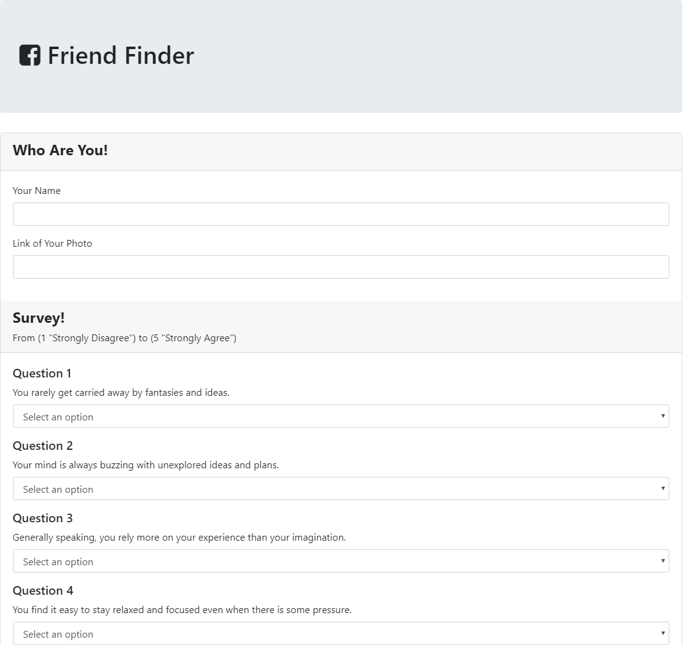
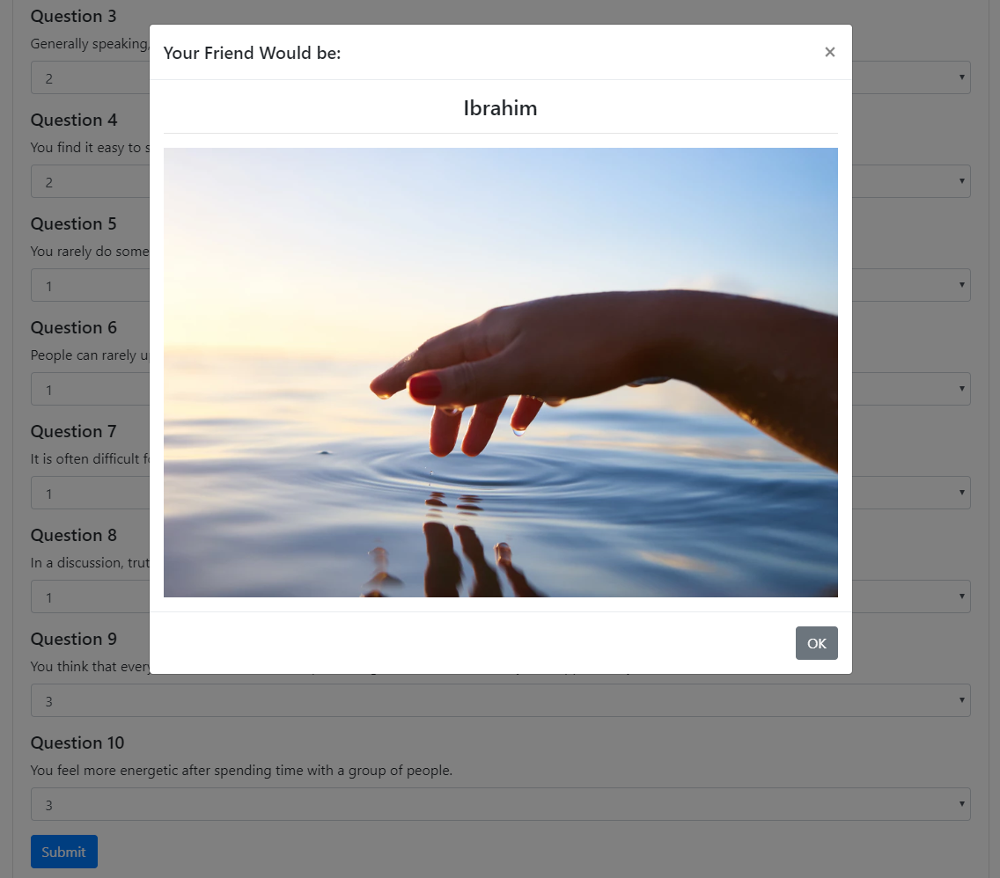

# Friend Finder using NodeJS and Express 

## Overview
This application is a Friend finder questionnaire using NodeJS, Express, and local JSON file for saving friends information.

## Project Dependencies:
This app requires this node package: `Express`.

## Basic Usage:
The app runs by navigating into the directory of the app folder, and then type the command  `node server.js` in the command line terminal.

* To access the app, open the web-browser and navigate to: "localhost:3000", then the following parts will be seen in the page:
  * At the landing page the app is informing that there are few basic questions to find the best matching friend based on the user's answers, and "Go to Survey" button to begun the survey.
  

  * Then, the app will ask the user answering 10 questions' survey.
  

  * Finally, the matched friend will be calculated and shown to the user as a pop-up card.
  

## Try it on HEROKU:
This link will jump you to test the application, have fun!
 
  * ["Try it"](https://obscure-fortress-70569.herokuapp.com/)

